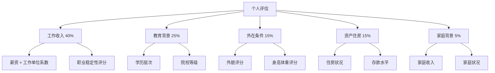
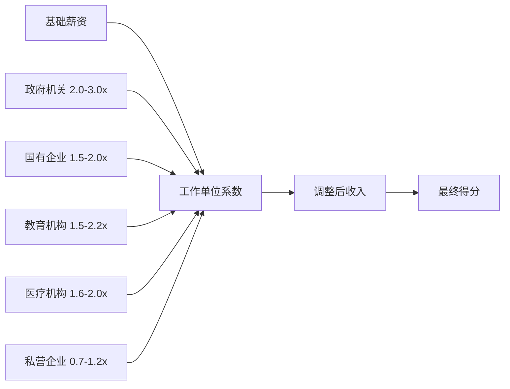

# 设计文档

## 概述

改进的相亲评价系统采用战略性的两阶段方法。第一阶段专注于通过精细化的物质条件对比创造具有病毒传播潜力的讨论内容，第二阶段将逐步引入全面的评价维度，引导用户建立更健康的择偶价值观。

### 第一阶段设计原则

1. **精准对比**: 超详细的物质条件评估，实现清晰的差异化
2. **传播潜力**: 设计天然具有社交媒体讨论价值的评价指标
3. **现实权重**: 反映真实的社会认知和相亲市场现实
4. **数据驱动**: 使用用户易于理解和分享的量化指标
5. **战略基础**: 为未来价值引导的演进建立用户基础

## 系统架构

### 第一阶段：物质条件导向的评分框架

第一阶段系统优先考虑可量化、可对比的指标，产生清晰的差异化：



### 工作收入系数系统



## 组件和接口

### 1. 第一阶段数据收集界面

**增强版个人信息表单组件**
- 超详细的物质条件评估
- 隐藏评分显示，避免填写过程中的偏见
- 社交分享集成，增强传播潜力
- 情侣/朋友对比模式

**第一阶段表单部分：**
- 工作收入评估（隐藏系数计算过程）
- 教育背景（学历 + 院校等级）
- 外在条件（外貌 + 身体指标，隐藏BMI评分指示器）
- 资产住房状况
- 家庭背景

**评分显示策略：**
- **填写阶段**：完全隐藏所有评分显示，包括：
  - 不显示任何维度的实时评分
  - 隐藏BMI指示器和健康评分
  - 不显示工作单位系数或调整后收入
  - 不显示教育背景评分预览
  - 不显示任何评分相关的视觉反馈
- **匹配计算后**：显示完整的评分分析和对比结果
- **目的**：避免填写过程中的心理偏见和数据扭曲，确保用户客观填写信息

### 2. 第一阶段评分引擎

**物质导向计算器服务**
```javascript
class MaterialFocusedCalculator {
  // 工作单位系数系统
  WORK_UNIT_MULTIPLIERS = {
    // 政府机关（最高稳定性，资源最多）
    'central_gov': 3.0,        // 中央部委
    'city_gov': 2.5,           // 市级政府
    'district_gov': 2.0,       // 区县政府
    'township_gov': 1.5,       // 镇/街道
    
    // 国有企业
    'central_soe_hq': 2.0,     // 央企总部
    'central_soe_branch': 1.5, // 央企分公司
    'local_soe': 1.5,          // 地方国企
    
    // 教育机构
    'top_university': 2.2,     // 985/211高校
    'university': 1.8,         // 普通高校
    'middle_school': 1.5,      // 中小学
    'research_institute': 1.8, // 科研院所
    
    // 医疗机构
    'top_hospital': 2.0,       // 三甲医院
    'hospital': 1.6,           // 普通医院
    
    // 私营企业
    'famous_foreign': 1.2,     // 知名外企
    'tech_giant': 0.9,         // 互联网大厂
    'finance': 0.8,            // 金融机构
    'private_company': 0.8,    // 普通私企
    'startup': 0.7,            // 创业公司
    'freelance': 0.6,          // 自由职业
    'unemployed': 0.1          // 无业
  }
  
  // 核心计算方法
  calculateWorkIncomeScore(salary, workUnit)
  calculateEducationScore(education, universityTier)
  calculatePhysicalScore(gender, height, weight, appearance)
  calculateHousingScore(housingStatus, location)
  calculateOverallScore(person)
  
  // 对比方法
  calculateCompetitiveAdvantage(person1, person2)
  generateMarketValueAnalysis(person)
}
```

### 3. 个性化引擎

**权重自定义组件**
- 交互式滑块调整权重
- 预设配置（传统型、现代型、平衡型）
- 实时评分预览
- 保存/加载自定义配置

**用户偏好服务**
```javascript
class UserPreferences {
  saveWeightConfiguration(userId, weights)  // 保存权重配置
  loadWeightConfiguration(userId)           // 加载权重配置
  getPresetConfigurations()                 // 获取预设配置
  validateWeightConfiguration(weights)      // 验证权重配置
}
```

### 4. 增强报告系统

**详细分析报告组件**
- 多标签页界面展示不同分析维度
- 交互式图表和可视化
- 可操作的改进建议
- 兼容性详细分解和说明

**报告生成服务**
```javascript
class ReportGenerator {
  generatePersonalReport(person, scores)                    // 生成个人报告
  generateCompatibilityReport(person1, person2, compatibility) // 生成兼容性报告
  generateImprovementPlan(person, targetAreas)              // 生成改进计划
  generateTrendAnalysis(historicalData)                     // 生成趋势分析
}
```

## 数据模型

### 第一阶段个人模型

```javascript
const Phase1PersonModel = {
  // 基本信息
  basicInfo: {
    age: Number,
    gender: String, // 'male' | 'female'
    location: String,
    height: Number, // cm
    weight: Number  // kg
  },
  
  // 工作收入（40%权重）
  workIncome: {
    salary: Number,           // 月薪(万元)
    workUnit: String,         // 工作单位类型
    workUnitMultiplier: Number, // 自动计算的系数
    adjustedIncome: Number,   // salary × multiplier
    jobTitle: String,         // 职位
    workYears: Number         // 工作年限
  },
  
  // 教育背景（25%权重）
  education: {
    degree: String,           // 'high_school' | 'college' | 'bachelor' | 'master' | 'phd'
    universityTier: String,   // 'qingbei' | 'c985' | 'c211' | 'tier1' | 'tier2' | 'private'
    major: String,            // 专业
    graduationYear: Number    // 毕业年份
  },
  
  // 外在条件（15%权重）
  physicalAttributes: {
    appearance: String,       // 'excellent' | 'very_good' | 'above_average' | 'below_average' | 'poor'
    bmi: Number,             // 自动计算
    physicalScore: Number     // 综合身体条件得分
  },
  
  // 资产住房（15%权重）
  assets: {
    housingStatus: String,    // 'beijing_house_inner' | 'beijing_house_outer' | 'beijing_house_loan' | 'other_city_house' | 'rent' | 'live_with_parents'
    savings: Number,          // 存款(万元)
    otherAssets: Array,       // 其他资产
    debt: Number             // 负债(万元)
  },
  
  // 家庭背景（5%权重）
  familyBackground: {
    parentsIncome: Number,    // 父母月收入(万元)
    familyAssets: String,     // 家庭资产状况
    onlyChild: Boolean,       // 是否独生子女
    parentsOccupation: String // 父母职业
  }
}
```

### 第一阶段评分算法

```javascript
// 工作收入评分（40%权重）
const calculateWorkIncomeScore = (salary, workUnit) => {
  const multiplier = WORK_UNIT_MULTIPLIERS[workUnit] || 0.8
  const adjustedIncome = salary * multiplier
  
  if (adjustedIncome >= 30) return 100      // 调整后月收入30万+
  if (adjustedIncome >= 20) return 95       // 20-30万
  if (adjustedIncome >= 15) return 90       // 15-20万
  if (adjustedIncome >= 10) return 85       // 10-15万
  if (adjustedIncome >= 8) return 80        // 8-10万
  if (adjustedIncome >= 6) return 75        // 6-8万
  if (adjustedIncome >= 4) return 70        // 4-6万
  if (adjustedIncome >= 3) return 65        // 3-4万
  if (adjustedIncome >= 2) return 60        // 2-3万
  if (adjustedIncome >= 1.5) return 50      // 1.5-2万
  if (adjustedIncome >= 1) return 40        // 1-1.5万
  return 30                                 // 1万以下
}

// 教育评分（25%权重）
const calculateEducationScore = (degree, universityTier) => {
  const baseScores = {
    'high_school': 30,
    'college': 50,
    'bachelor': 70,
    'master': 85,
    'phd': 90
  }
  
  const tierScores = {
    'qingbei': 100,      // 清华北大
    'c985': 95,          // 985院校
    'c211': 90,          // 211院校
    'tier1': 80,         // 一类本科
    'tier2': 70,         // 二类本科
    'private': 60        // 民办本科
  }
  
  if (['bachelor', 'master', 'phd'].includes(degree)) {
    const baseScore = baseScores[degree]
    const tierScore = tierScores[universityTier] || 60
    return Math.min(100, baseScore + (tierScore - 60) * 0.5)
  }
  
  return baseScores[degree]
}

// 外在条件评分（15%权重）
const calculatePhysicalScore = (gender, height, weight, appearance) => {
  const bmi = weight / ((height / 100) ** 2)
  let score = 50 // 基础分
  
  // 外貌评分
  const appearanceScores = {
    'excellent': 100,
    'very_good': 85,
    'above_average': 70,
    'below_average': 50,
    'poor': 30
  }
  score = appearanceScores[appearance] || 50
  
  // 身高调整
  if (gender === 'male') {
    if (height >= 180) score += 10
    else if (height >= 175) score += 5
    else if (height < 170) score -= 10
  } else {
    if (height >= 165) score += 5
    else if (height < 155) score -= 10
  }
  
  // BMI调整
  if (bmi >= 18.5 && bmi <= 24) score += 5
  else if (bmi > 28 || bmi < 18) score -= 15
  
  return Math.max(0, Math.min(100, score))
}

// 资产住房评分（15%权重）
const calculateHousingScore = (housingStatus, savings) => {
  const housingScores = {
    'beijing_house_inner': 100,    // 北京环内房产
    'beijing_house_outer': 90,     // 北京环外房产
    'beijing_house_loan': 75,      // 北京贷款房产
    'other_city_house': 50,        // 外地房产
    'rent': 30,                    // 租房
    'live_with_parents': 20        // 与父母同住
  }
  
  const savingsScore = (() => {
    if (savings >= 1000) return 100
    if (savings >= 500) return 90
    if (savings >= 200) return 80
    if (savings >= 100) return 70
    if (savings >= 50) return 60
    if (savings >= 20) return 50
    if (savings >= 10) return 40
    return 30
  })()
  
  return (housingScores[housingStatus] * 0.7 + savingsScore * 0.3)
}

// 家庭背景评分（5%权重）
const calculateFamilyScore = (parentsIncome, onlyChild) => {
  let score = 60 // 基础分
  
  if (parentsIncome >= 5) score = 100
  else if (parentsIncome >= 3) score = 90
  else if (parentsIncome >= 2) score = 80
  else if (parentsIncome >= 1) score = 70
  else if (parentsIncome >= 0.5) score = 60
  else score = 50
  
  // 独生子女调整（独生子女压力大）
  if (onlyChild) score -= 10
  
  return Math.max(0, Math.min(100, score))
}
```

### 第一阶段权重配置

```javascript
const PHASE1_WEIGHTS = {
  workIncome: 0.40,        // 工作收入 40%
  education: 0.25,         // 教育背景 25%
  physicalAttributes: 0.15, // 外在条件 15%
  assets: 0.15,            // 资产住房 15%
  familyBackground: 0.05   // 家庭背景 5%
}
```

### 病毒式传播功能设计

```javascript
// 市场价值分析
const generateMarketValueAnalysis = (person) => {
  const score = calculateOverallScore(person)
  const percentile = calculatePercentile(score)
  
  return {
    overallScore: score,
    marketPercentile: percentile,
    competitiveAdvantages: identifyStrengths(person),
    improvementAreas: identifyWeaknesses(person),
    socialShareText: generateShareText(score, percentile)
  }
}

// 对比分析
const generateComparisonAnalysis = (person1, person2) => {
  const scores1 = calculateDetailedScores(person1)
  const scores2 = calculateDetailedScores(person2)
  
  return {
    winner: scores1.total > scores2.total ? person1 : person2,
    scoreDifference: Math.abs(scores1.total - scores2.total),
    dimensionComparison: compareDimensions(scores1, scores2),
    matchCompatibility: calculateMatchScore(scores1.total, scores2.total)
  }
}
```

## 错误处理

### 输入验证
- 全面的表单验证和用户友好的错误信息
- 数值输入的范围检查
- 相关字段的一致性验证
- 渐进式验证引导用户输入

### 计算错误处理
- 优雅处理缺失数据点
- 不完整档案的回退评分
- 调试和改进的错误日志
- 计算问题的用户通知

## 测试策略

### 单元测试
- 个别评分函数验证
- 极值边界情况处理
- 数学准确性验证
- 性能基准测试

### 集成测试
- 端到端评分工作流验证
- 跨组件数据流验证
- 用户偏好持久化测试
- 报告生成准确性测试

### 用户体验测试
- 新表单界面可用性测试
- 不同权重配置的A/B测试
- 大数据集性能测试
- 无障碍合规性验证

## 实施考虑

### 性能优化
- 复杂计算的懒加载
- 常用配置的缓存
- 实时更新的优化算法
- 慢设备的渐进增强

### 可访问性
- 屏幕阅读器兼容性
- 键盘导航支持
- 高对比度模式支持
- 多语言支持准备

### 安全和隐私
- 敏感数据加密
- 用户同意管理
- 分析数据匿名化
- 安全偏好存储

### 可扩展性
- 易于扩展的模块化架构
- 自定义标准的插件系统
- 未来移动应用的API设计
- 增长的数据库优化